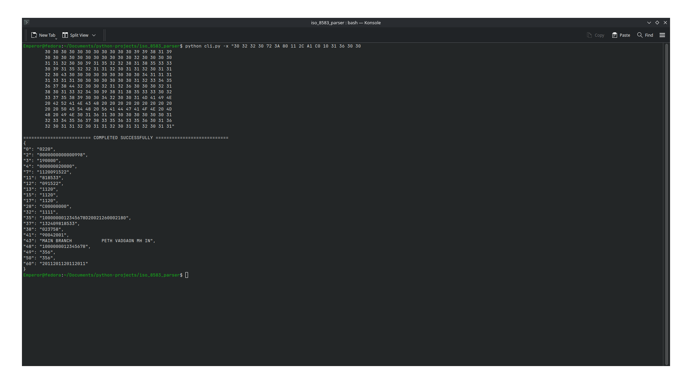
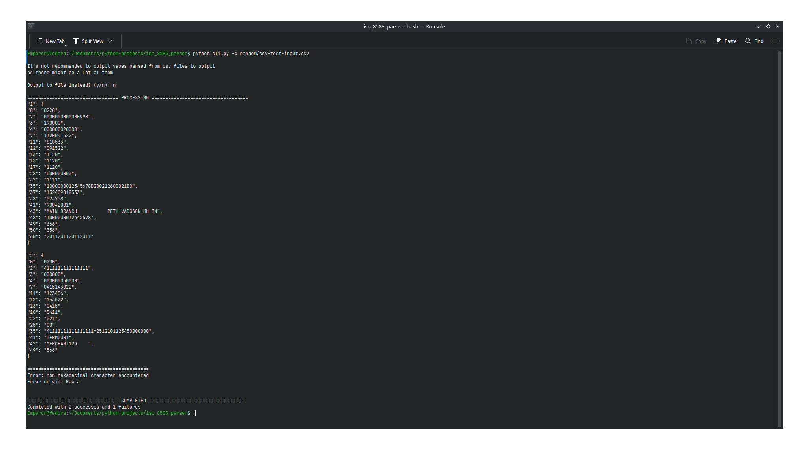
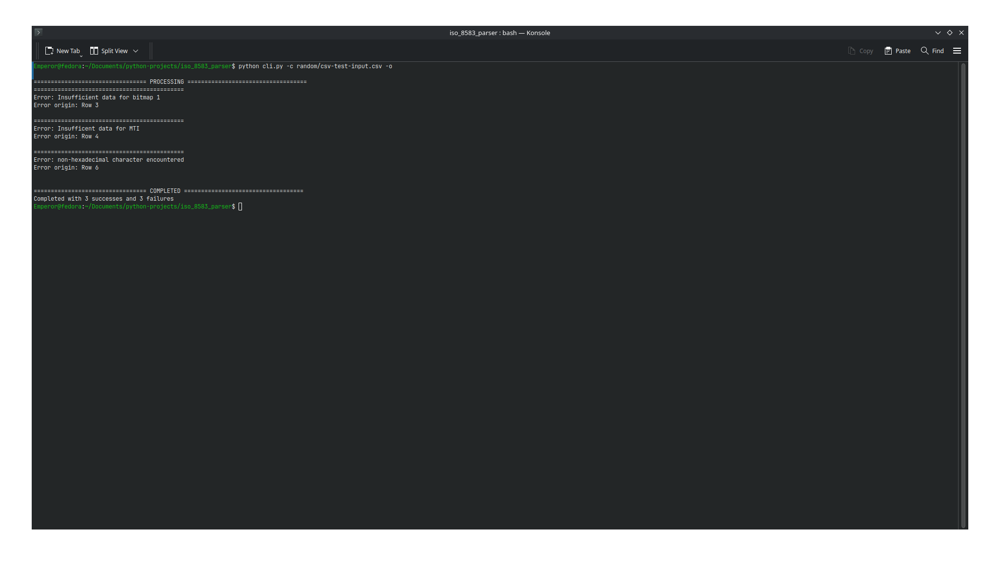

# iso_8583_parser
iso_8583_parser is a Python tool for parsing ISO 8583 financial messaging protocol 
messages from hexadecimal format to human-readable JSON.

ISO 8583 is the international standard for financial transaction messages used by payment networks, ATMs, and point-of-sale systems worldwide.

## Features
- Full bitmap parsing (primary and secondary)
- LLVAR and LLLVAR variable-length field support  
- All 128 data elements from the ISO 8583:1987 spec
- Robust error handling with descriptive messages
- CLI tool for single message parsing or batch CSV processing
- Zero external dependencies

## Installation
```
git clone https://github.com/LOVE-CRAFTT/iso_8583_parser.git
cd iso_8583_parser
```
> Requires Python 3.10+

## Usage
- Run python cli.py or python cli.py -h to get full help information

### Parsing single messages
```
python cli.py -x "30 32 30 30 F2 38 44 80 20 C0 80 00 00 00 00 00 ..." -> outputs to terminal
```
```
python cli.py -x "30 32 30 30 F2 38 44 80 20 C0 80 00 00 00 00 00 ..." -o -> outputs to output.json
```
```
python cli.py -x "30 32 30 30 F2 38 44 80 20 C0 80 00 00 00 00 00 ..." -o file -> outputs to file.json
```

### Batch parsing from csv files
```
python cli.py --csv csvfile.csv -o -> outputs to output.json
```
```
python cli.py -c csvfile.csv -o file -> outputs to file.json
```
```
python cli.py -c csvfile.csv -> outputs to terminal (not recommended)
```

NOTE: For .csv files, it's expected that each row contains a single message and nothing else, see <a href="./misc/csv-test-input.csv">csv-test-input</a> for samples
> Sample messages used for testing were sourced from Sarvatra technologies' ISO 8583 message specifications document for their EFT Switch product.

## Demo
- Parsing hex to terminal


- Parsing csv to terminal


- Parsing csv to file


## Limitations
- This is an implementation of the 1987 spec only.
- It's assumed that each hex byte represents a single ASCII character, i.e no BCD   compression

## Future Work
- Add support for BCD compression
- Add ability to convert JSON to ISO 8583 message format
- Add support for the 1993 and 2003 specs

## Contact
Created by Chukwuemeka Brendan Chukwudi.

For bug report and feature requests, please open an issue.

For private inquiries or collaborations: chukwuemekachukwudi9@gmail.com